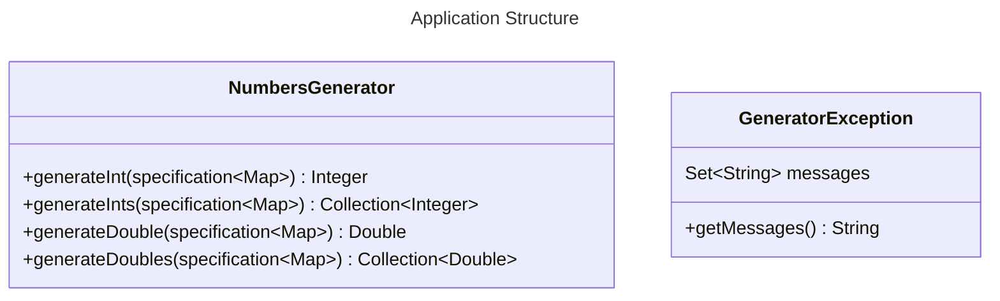

# n8 - Nate, a convenient values generator

```mermaid
---
title: Application Structure 
---

classDiagram
    class NumbersGenerator
    NumbersGenerator : +generateInt(specification~Map~) Integer
    NumbersGenerator : +generateInts(specification~Map~) Collection~Integer~
    NumbersGenerator : +generateDouble(specification~Map~) Double
    NumbersGenerator : +generateDoubles(specification~Map~) Collection~Double~

    class GeneratorException
    GeneratorException : Set~String~ messages
    GeneratorException: +getMessages() String

```
